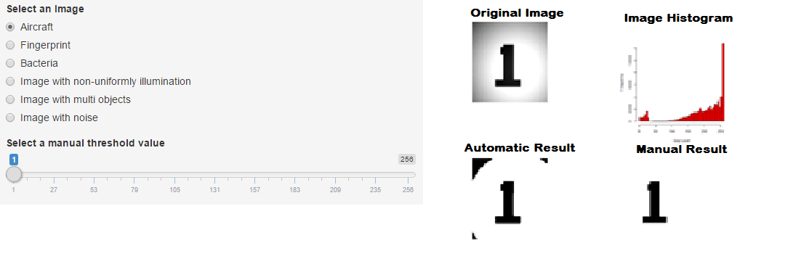
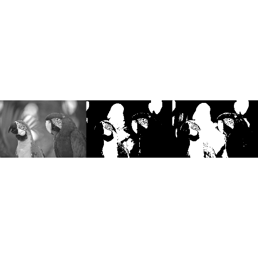

Developing Data Product Presentation: Automatic Clustering Based on Digital Image Thresholding
========================================================
author: Akremhub
date: 15-May-2015
transition: rotate 
Why This Presenation 
========================================================
This presentation is prepared as part of the project of  the 
Developing Data Product course at Coursera. The main focus of the project is to:

- Build data product App using Shiny. 
- Prepare a presentation using Slidify or Rstudio Presenter.

App Links:

The App code is available at Github in the following repo
 
https://github.com/AkremHub/DevelopingDataProductProject/

Click to use/test the App at shinyapps.io

https://akremhub.shinyapps.io/DevelopingDataProductProject/

General Description of the App
========================================================
This App is designed to illustarte the automatic clustering based on digital image (2-D data) thresholding using the well-known Otsu algorithm[1].
Automatic clustering based on image thresholding is the process in which  a grey-level image is clustered into two classes:object and bakground.Otsu algorithm automatically select an optimum threshold  value (T) (between 0 and 255). Then the threshold value is  used to threshold  the gray level image into two colors 0( black) and 255(White). In other words, it reduces a graylevel image to a binary image.

[1- https://en.wikipedia.org/wiki/Otsus_method'](https://en.wikipedia.org/wiki/Otsus_method)

How to Use the App
========================================================

- The user can choose one of six  images.
- The App will automatic cluster the selected digital image(using Otsu Algorithm) and display the  result and  image histogram to the user.
- The user can select a manual threshold value and see his/her results compared to the original image and Otsu result.

Main Menu



Simple Example 
========================================================
The following shows an example of using Otsu algorithm and manual thresholding.

```r
library(EBImage);f = system.file("images","sample.png",package="EBImage")
gimg = readImage(f);threshold = otsu(gimg);bImg=gimg>threshold;mImg=gimg>.45;
display(rbind(gimg,bImg,mImg))
```


